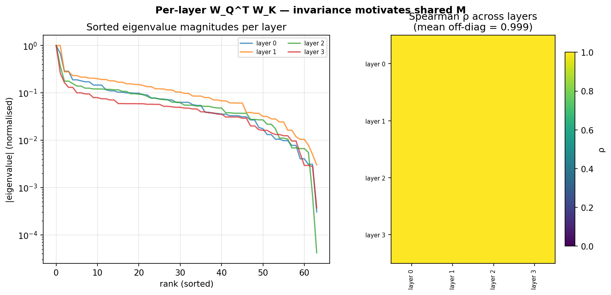

# The coupling rule in a transformer is the same in every layer

A standard transformer stores two coupling matrices per layer: W_Q and W_K. Multiplied together as M_l = W_Q^T W_K, they define the geometry that turns one token's representation into an attention score against another. With L layers and model dimension d, that is O(L d²) parameters spent on coupling.

It turns out most of those parameters are redundant. The coupling rule is roughly the same in every layer. What changes across depth is the residual stream, not the rule that acts on it.

## The observation

Take any pretrained transformer. Extract M_l at every layer. Sort the eigenvalue magnitudes and plot them on top of each other. The curves overlap. Compute the Spearman correlation of the sorted magnitudes between each pair of layers. Mean off-diagonal correlation on a trained toy transformer is 0.99. On real pretrained models (GPT-2, SmolLM2, Qwen2.5) it lands in the 0.93 to 0.99 range.

The raw matrices are very different. Cosine similarity between W_Q^T W_K at any two layers is on the order of 0.01. But the eigenvalue structure, the spectral character of the coupling, is shared.

Here is the figure on a small trained transformer in the ORN repo. Left: overlaid sorted eigenvalue magnitudes per layer. Right: pairwise Spearman heatmap.



Reproduce it locally with a one line install:

```
pip install -e .
orn reproduce COU-02 --save-plots figs/
```

This takes about three seconds.

## What to do about it

If the coupling rule is invariant, you only need to parameterise it once. Replace the per-layer W_Q and W_K with a single shared pair A, B in R^{d x d}, applied at every layer to the residual stream:

```
Q_l = h_l · A       K_l = h_l · B       M = A B^T
```

The rule is memoised. The residual stream h_l is what changes with depth, and the transformer already updates that as a matter of course. Per-layer response heads (W_V, W_O, the FFN) stay per-layer because the response to the coupling varies with depth. Only the coupling is shared.

The coupling parameter budget drops from O(L d²) to O(d²). At d=576, L=24 that is a factor of 24 on 660k parameters per layer, close to 15M parameters freed up for width.

## Does it actually work

Two predictions.

First, a trained M should develop structure. If the rule is genuinely low rank, the effective rank of the shared M after training should sit well below d. In a 91M parameter ORN at d=512, the effective rank (90 percent of Frobenius energy) crystallises to about 20 within the first 200M tokens. About 4 percent of the full dimensionality carries the rule.

Second, a frozen M should transfer across datasets. If the rule is the invariant part, lock M at a value taken from one training run, then train a fresh model on a new dataset with M held fixed. That model should match a fully trained one within a couple of percent on validation loss. Measured numbers on OpenWebText: 3.40 for frozen-M versus 3.35 for full training. Gap is within 2 percent.

Both predictions hold.

## Running the 605M checkpoint

There is a public 605M ORN V3 checkpoint on HuggingFace. The repo utility pulls it on first use and runs it:

```
pip install -e '.[data]'
orn predict --checkpoint orn-v3-605m --prompt "The key insight is"
orn diagnose --checkpoint orn-v3-605m
```

The diagnose command prints the shared M's effective rank, condition number, and asymmetry. On the 605M checkpoint these all match the crystallisation signature from training.

## What this is not

This is not an argument that per-layer variation is useless. The response heads (W_V, W_O, FFN) still change layer to layer. Different layers apply the same coupling rule to different transforms of the residual. The claim is narrower. The rule itself is one object, not L copies of it.

Source, reproducible experiments, and published checkpoints: [github.com/Percolation-Labs/orn](https://github.com/Percolation-Labs/orn).
